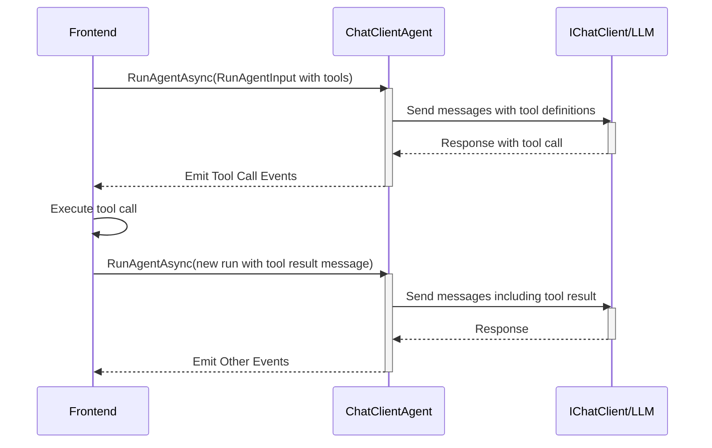
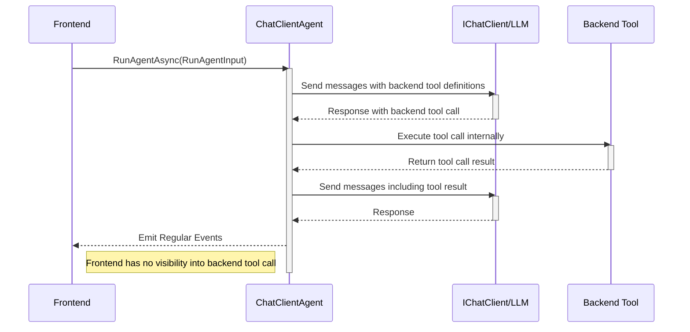
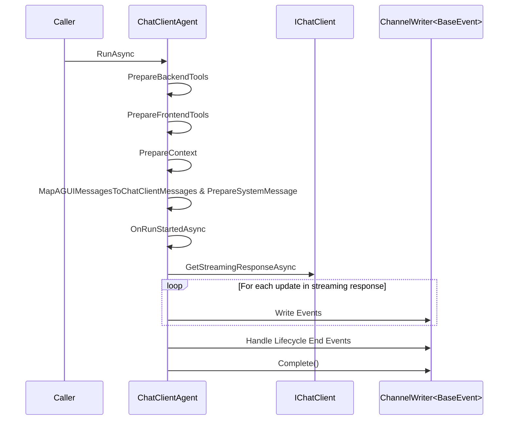

# The ChatClientAgent

The `ChatClientAgent` is a simple agent implementation that uses an underlying
`IChatClient` to power the common scenario of running an agent that involves an
LLM conversational flow.

It handles emitting the core lifecycle events and managing both frontend and
backend tool calls, making it an easy way to get started with building agents
using the existing `IChatClient` compatible providers and backend tools you
already have.

## Usage

```csharp
var myProviderIChatClient = GetProviderIChatClient();

var chatClient = new ChatClientBuilder(myProviderIChatClient)
    .UseFunctionInvocation()
    .Build();

var agent = new ChatClientAgent(
    chatClient,
    new ChatClientAgentOptions
    {
        // Options for configuring behaviour
    }
)

await foreach(var emittedEvent in
    agent.RunToCompletionAsync(runAgentInput, cancellationToken))
{
    // Handle emitted events
}
```

This example shows how to create the barest `ChatClientAgent` that uses the
provided `IChatClient` and simply acts as a proxy for the client to emit the
Agent User Interaction Protocol events, while supporting frontend tool calls.

## Options

The agent can be configured using the (optional) `ChatClientAgentOptions`:

```csharp
public record ChatClientAgentOptions
{
    public ChatOptions? ChatOptions { get; init; }

    public bool PreserveInboundSystemMessages { get; init; } = true;

    public string? SystemMessage { get; init; }

    public bool PerformAiContextExtraction { get; init; } = false;

    public bool IncludeContextInSystemMessage { get; init; } = false;

    public bool StripSystemMessagesWhenEmittingMessageSnapshots { get; init; } = true;

    public bool EmitBackendToolCalls { get; init; } = true;
}
```

| Property                                          | Type           | Description                                                                                                                                                                                               |
| ------------------------------------------------- | -------------- | --------------------------------------------------------------------------------------------------------------------------------------------------------------------------------------------------------- |
| `ChatOptions`                                     | `ChatOptions?` | The same options you're used to passing when using the `IChatClient` directly - configure LLM behaviour and register tools.                                                                               |
| `PreserveInboundSystemMessages`                   | `bool`         | If true, the agent will preserve system messages from the input and not override them with its own. Defaults to true.                                                                                     |
| `SystemMessage`                                   | `string?`      | If set, this will override the system message passed in the `RunAgentInput`. Defaults to null, meaning it uses the input.                                                                                 |
| `PerformAiContextExtraction`                      | `bool`         | If true, the `IChatClient` will be used to try to extract `Context` from the input system message. Defaults to false.                                                                                     |
| `IncludeContextInSystemMessage`                   | `bool`         | If true, the agent will include items in the final `Context` collection in the system message passed to the LLM. By default if and only if a custom `SystemMessage` has been provided. Defaults to false. |
| `StripSystemMessagesWhenEmittingMessageSnapshots` | `bool`         | If true, the agent will strip system messages from the message snapshots it emits. Defaults to true.                                                                                                      |
| `EmitBackendToolCalls`                            | `bool`         | If true, the agent will emit events for backend tool calls. Defaults to true.                                                                                                                             |

## AI Context Extraction

`RunAgentInput` has a `Context` property that allows frontends to provide
additional context data to the agent.

However, some frontends (like [CopilotKit](https://www.copilotkit.ai)) may not
provide context via this mechanism, and instead will be submitting it as part of
the system message/s passed to the agent in the messages collection.

If you set `PerformAiContextExtraction` to true, the agent will use the
underlying `IChatClient` to try and extract context from the system message, and
make that context available to the agent as if it was provided in the
`RunAgentInput`.

You can use this in conjunction with `IncludeContextInSystemMessage` to ensure
that the context is included in your custom system message (via the
`SystemMessage` property), which can be useful for situations where your
frontend has a lot of ambient context that is not yet being explicity provided
to the agent.

<Warning>
    This feature relies on structured responses from the underlying LLM, so support is not universal.

    It can also be temperamental, so by default the agent will try once to extract context and if it fails due to a JSON parsing error, it will simply fallback to the provided context in the `RunAgentInput`.

</Warning>

## Function Calling

In order to use function calling, the following must be true:

1. The `IChatClient` you provide must support function calling using the
   standard `FunctionInvokingChatClient` mechanism provided by the
   `Microsoft.Extensions.AI` package.
2. The LLM you are using must support function calling.

<Warning>
  Due to the way function calling works in `Microsoft.Extensions.AI`, and the
  necessity to support frontend tool calls, the agent will forcefully disable
  multiple tool calls in a single message, and therefore does not support
  parallel tool calls.

If your `IChatClient` or LLM forces this behaviour, the agent may behave
unexpectedly.

</Warning>

### Frontend Tool Calls

If your frontend passes tools in the `RunAgentInput`, these will be exposed to
the LLM and if it calls them, the agent will emit the necessary Agent User
Interaction Protocol events to request the tool call.

The run will then end, and the frontend will be expected to handle the tool
call, produce a tool call result message, and then call the agent again on a new
run in the same thread with the tool call result message in the `messages`
collection.



### Backend Tool Calls

The agent supports backend tool calls by using the same tool registration
mechanisms as regular `IChatClient` interactions.

You can register backend tools using the `ChatOptions` property in the
`ChatClientAgentOptions` as follows:

```csharp
static DateTimeOffset GetCurrentDateTime() =>
    DateTimeOffset.UtcNow;

var myProviderIChatClient = GetProviderIChatClient();

var chatClient = new ChatClientBuilder(myProviderIChatClient)
    .UseFunctionInvocation()
    .Build();

var agent = new ChatClientAgent(
    chatClient,
    new ChatClientAgentOptions {
        ChatOptions = new ChatOptions {
            Tools = [
                AiFunctionFactory.Create(
                    GetCurrentDateTime,
                    "GetCurrentDateTime",
                    "Returns the current date and time in UTC"
                )
            ]
        }
    }
);
```

This exposes the `GetCurrentDateTime` function to the LLM, and will use the
standard function calling mechanism in the `Microsoft.Extensions.AI` system.

#### Backend Tool Call Visibility to the Frontend

When the LLM calls a backend tool, you can use the `EmitBackendToolCalls` option
on the `ChatClientAgentOptions` to control whether the agent emits information
to the frontend about the backend tool call.

<Warning>
When this option is set to `true`, the agent will emit the necessary events, and issue a message snapshot upon completion of the run to communicate results.

Use with caution, as this means the frontend will have full visibility into not
only the tool call names, but the arguments and the serialized results of the
tool calls - which could contain sensitive information.

A filtration mechanism is provided if you derive your own agent from
`ChatClientAgent`.

</Warning>



## Deriving Your Own Agent

When you need more control over the agent's behaviour, or want to use it as a
base for your own agent, you can derive from the `ChatClientAgent` class.

It provides the following members for overriding:

```csharp
protected virtual ValueTask<ImmutableList<AIFunction>> PrepareBackendTools
(
    ImmutableList<AIFunction> backendTools,
    RunAgentInput input,
    ChannelWriter<BaseEvent> events,
    CancellationToken cancellationToken = default
)

protected virtual ValueTask<ImmutableList<FrontendTool>> PrepareFrontendTools
(
    ImmutableList<FrontendTool> frontendTools,
    RunAgentInput input,
    CancellationToken cancellationToken = default
)

protected virtual async Task<ImmutableList<Context>> PrepareContext
(
    RunAgentInput input,
    CancellationToken cancellationToken = default
)

protected virtual ValueTask<string> PrepareSystemMessage
(
    RunAgentInput input,
    string systemMessage,
    ImmutableList<Context> context
)

protected virtual async ValueTask<ImmutableList<ChatMessage>> MapAGUIMessagesToChatClientMessages
(
    RunAgentInput input,
    ImmutableList<Context> context,
    CancellationToken cancellationToken = default
)

protected virtual ValueTask<bool> ShouldEmitBackendToolCallData
(
    string functionName
)

protected virtual async ValueTask OnRunStartedAsync
(
    RunAgentInput input,
    ChannelWriter<BaseEvent> events,
    CancellationToken cancellationToken = default
)
```

Each and every one of these methods has default implementations that drive their
behaviour from the `ChatClientAgentOptions` and represent default behaviour for
managing a bare-bones conversational agent with function calling support.

### Method Invocation Flow

The agent flow looks as follows:



### `PrepareBackendTools`

This method is called to prepare the backend tools that will be available to the
agent.

| Argument            | Type                        | Description                                                                                                                                           |
| ------------------- | --------------------------- | ----------------------------------------------------------------------------------------------------------------------------------------------------- |
| `backendTools`      | `ImmutableList<AIFunction>` | The backend tools (if any) that were discovered via the provided `ChatOptions`.                                                                       |
| `input`             | `RunAgentInput`             | The AG-UI RunAgentInput passed to the agent.                                                                                                          |
| `events`            | `ChannelWriter<BaseEvent>`  | The channel to write events to—useful for when you want your tools to have access to this (e.g., for dispatching state updates, custom events, etc.). |
| `cancellationToken` | `CancellationToken`         | The cancellation token for the operation.                                                                                                             |

An example of how this is extended by the `StatefulChatClientAgent`:

```csharp
protected override async ValueTask<ImmutableList<AIFunction>> PrepareBackendTools(
    ImmutableList<AIFunction> backendTools,
    RunAgentInput input,
    ChannelWriter<BaseEvent> events,
    CancellationToken cancellationToken = default
)
    {
        return [
            .. await base.PrepareBackendTools(
                backendTools,
                input,
                events,
                cancellationToken
            ),

            AIFunctionFactory.Create(
                RetrieveState,
                name: "retrieve_state",
                description: "Retrieves the current shared state of the agent."
            ),

            AIFunctionFactory.Create(
                async (TState newState) => {
                    var delta = _currentState.CreatePatch(newState, _jsonSerOpts);
                    if (delta.Operations.Count > 0) {
                        UpdateState(newState);
                        await events.WriteAsync(new StateDeltaEvent {
                            Delta = [.. delta.Operations.Cast<object>()],
                            Timestamp = DateTimeOffset.UtcNow.ToUnixTimeMilliseconds(),
                        }, cancellationToken);
                    }
                },
                name: "update_state",
                description: "Updates the current shared state of the agent."
            )
        ];
    }
```

This shows how easily you can extend the core backend tools to add your own for
your specific agent in conjunction with the ones provided by the `ChatOptions`
to provide agent-specific functionality.

You have access to the events channel writer here, so you can emit events as
needed.

### `PrepareFrontendTools`

This method allows you to modify the frontend tools that will be available to
the agent.

| Argument            | Type                          | Description                                                                        |
| ------------------- | ----------------------------- | ---------------------------------------------------------------------------------- |
| `frontendTools`     | `ImmutableList<FrontendTool>` | The frontend tools (if any) that were discovered via the provided `RunAgentInput`. |
| `input`             | `RunAgentInput`               | The AG-UI RunAgentInput passed to the agent.                                       |
| `cancellationToken` | `CancellationToken`           | The cancellation token for the operation.                                          |

An example of how you could use this to filter out frontend tools that you do
not want to expose:

```csharp
protected override ValueTask<ImmutableList<FrontendTool>> PrepareFrontendTools(
    ImmutableList<FrontendTool> frontendTools,
    RunAgentInput input,
    CancellationToken cancellationToken = default
)
{
    return new ValueTask<ImmutableList<FrontendTool>>(
        frontendTools.Where(tool => tool.Name != "unwanted_tool").ToImmutableList()
    );
}
```

### `PrepareContext`

This method allows you to prepare the context collection that was passed in the
`RunAgentInput` in the `Context` property.

The default implementation takes its cue from the `PerformAiContextExtraction`
property on the `ChatClientAgentOptions` as to what to do with the provided
context.

If your backend system wants to provide additional context, you can override
this method to do so.

| Argument            | Type                | Description                                  |
| ------------------- | ------------------- | -------------------------------------------- |
| `input`             | `RunAgentInput`     | The AG-UI RunAgentInput passed to the agent. |
| `cancellationToken` | `CancellationToken` | The cancellation token for the operation.    |

Usage:

```csharp
protected override async Task<ImmutableList<Context>> PrepareContext(
    RunAgentInput input,
    CancellationToken cancellationToken = default
)
{
    return [
        // Include the base context with AI extraction if enabled
        .. await base.PrepareContext(input, cancellationToken),

        // Add custom context
        new Context {
            Description = "Custom context",
            Value = await ResolveCustomContextValueAsync(cancellationToken)
        }
    ]
}
```

### `MapAGUIMessagesToChatClientMessages`

This method is responsible for taking the Agent User Interaction Protocol
Messages provided in the `RunAgentInput` and mapping them to the `IChatClient`
compatible types.

The default implementation maps the messages using sensible defaults, and
depending on whether a `SystemMessage` or `PreserveInboundSystemMessages` is
set, it will also call the `PrepareSystemMessage` method to get the final system
message to use.

<Warning>
  The agent will NOT automatically call `PrepareSystemMessage` if you override
  this method and do not call it yourself, so if you want to make use of the
  method, be sure to call it in your override.
</Warning>

| Argument            | Type                     | Description                                                              |
| ------------------- | ------------------------ | ------------------------------------------------------------------------ |
| `input`             | `RunAgentInput`          | The AG-UI RunAgentInput passed to the agent.                             |
| `context`           | `ImmutableList<Context>` | The context collection that was prepared in the `PrepareContext` method. |
| `cancellationToken` | `CancellationToken`      | The cancellation token for the operation.                                |

Most of the time it isn't envisioned you'll need to override this method, but it
is here if you need to do something custom with the messages.

### `PrepareSystemMessage`

This method receives the custom system message provided in the options, or
whatever system message you pass in when calling the method yourself, and
provides a way to modify it before it is used by the LLM.

| Argument        | Type                     | Description                                                                      |
| --------------- | ------------------------ | -------------------------------------------------------------------------------- |
| `input`         | `RunAgentInput`          | The AG-UI RunAgentInput passed to the agent.                                     |
| `systemMessage` | `string`                 | The system message provided in the options or passed in when calling the method. |
| `context`       | `ImmutableList<Context>` | The context collection that was prepared in the `PrepareContext` method.         |

### `ShouldEmitBackendToolCallData`

When `ChatClientAgentOptions.EmitBackendToolCalls` is set to `true`, this method
is called to determine whether the agent should emit the necessary data and do
the handling needed to communicate information about this tool call to the
frontend.

| Argument       | Type     | Description                                                                                                                      |
| -------------- | -------- | -------------------------------------------------------------------------------------------------------------------------------- |
| `functionName` | `string` | The name of the function that was called by the LLM. This is used to determine if the agent should emit data for this tool call. |

### `OnRunStartedAsync`

This method is called when all the preparation work has been completed, and the
run is about to start by calling the `IChatClient` to begin streaming response
updates.

The default implementation emits the `RunStartedEvent` lifecycle event for you,
so your override may want to call the base implementation first to avoid having
to emit it yourself.

| Argument            | Type                       | Description                                                                    |
| ------------------- | -------------------------- | ------------------------------------------------------------------------------ |
| `input`             | `RunAgentInput`            | The AG-UI RunAgentInput passed to the agent.                                   |
| `events`            | `ChannelWriter<BaseEvent>` | The channel to write events to—useful for when you want to emit custom events. |
| `cancellationToken` | `CancellationToken`        | The cancellation token for the operation.                                      |
